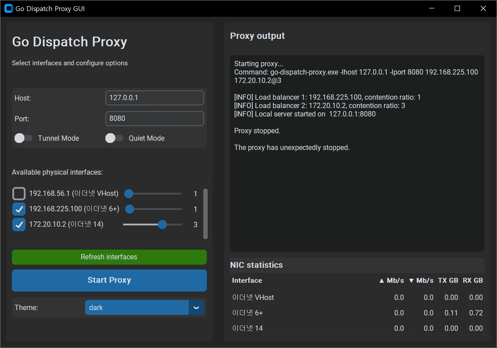

~~# Go Dispatch Proxy GUI~~
# go-dispatch-proxy-gui-more

Graphical interface for the command-line program `go-dispatch-proxy.exe` https://github.com/extremecoders-re/go-dispatch-proxy.

*This project is a continuation/fork of the original **go-dispatch-proxy-gui** by **Mirko (gulp79)** — thank you for the excellent foundation!*

~~~~



## Features

- Modern GUI with light/dark theme
- Smart detection of active physical network interfaces (excluding virtual interfaces)
- Full configuration of go-dispatch-proxy options
- Real-time display of proxy output
- Simplified proxy start/stop

## Requirements

- Windows (tested on Windows 10/11)
- [go-dispatch-proxy.exe](https://github.com/extremecoders-re/go-dispatch-proxy) (must be available in the system PATH or in the same folder as the application)

## Installation

### Method 1: Download the precompiled executable

1. Download the latest version of the application from the [Releases](https://github.com/gulp79/go-dispatch-proxy-gui/releases) section
2. Make sure [go-dispatch-proxy.exe](https://github.com/extremecoders-re/go-dispatch-proxy) is in the PATH or in the same folder
3. Run `GoDispatchProxyGUI.exe`

### Method 2: Build from source code

1. Clone or download this repository
2. Install the Python dependencies:
   ```
   pip install -r requirements.txt
   ```
3. Run the application directly:
   ```
   python go_dispatch_proxy_gui.py
   ```
4. To create a standalone executable:
   ```
   pyinstaller go-dispatch-proxy-gui.spec
   ```

## Usage

1. Launch the application
2. Select one or more network interfaces from the list
3. Configure the proxy options:
   - **Host**: The IP address on which the proxy will listen for SOCKS connections (default: 127.0.0.1)
   - **Port**: The port on which the proxy will listen for SOCKS connections (default: 8080)
   - **Tunnel Mode**: Enables tunnel mode (acts as a transparent load-balancing proxy)
   - **Silent Mode**: Disables on-screen messages
4. Click "Start Proxy" to begin
5. View the proxy output in the right-hand window
6. Click "Stop Proxy" to terminate

## Notes

- The application automatically detects only active physical network interfaces
- Virtual interfaces (VPN, Docker, VMware, WSL, etc.) and inactive interfaces are excluded
- Loopback (127.x.x.x) and link-local (169.254.x.x) addresses are filtered out
- The "Refresh Interfaces" button allows updating the list in case of changes
- Closing the application will automatically terminate the proxy process

## Changes in go-dispatch-proxy-gui-more

- Project renamed from `go-dispatch-proxy-gui` to `go-dispatch-proxy-gui-more`.
- Added more features to the GUI.
   - Added interface weight adjustment via slider (default: 1, max: 4).
   - Added real-time NIC statistics panel.

## License

[MIT License](LICENSE)


